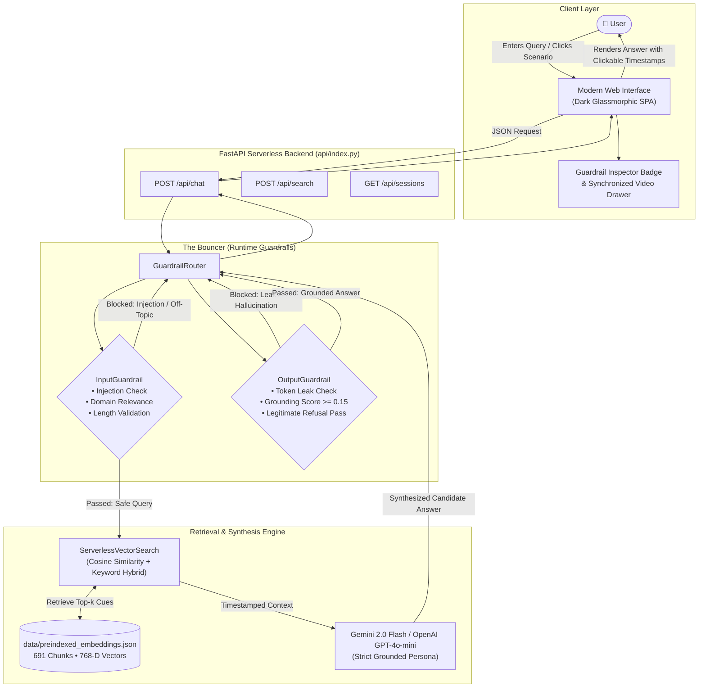
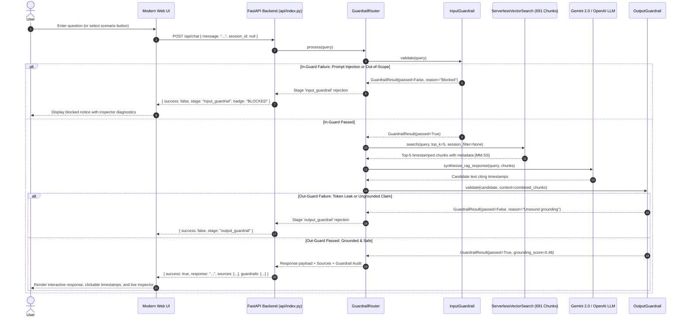

# Video RAG with Guardrails & Evals

[](https://video-rag-with-guardrails-evals.vercel.app)
[](https://www.python.org/)
[](https://fastapi.tiangolo.com/)
[](#automated-evaluations--quality-assurance)
[-purple?style=flat-square)](https://ai.google.dev/)
[](#llm-synthesis--graceful-fallback)

A production-grade, serverless **Video Retrieval-Augmented Generation (Video RAG)** application built over **5 complete Claude Code lecture sessions** (~9.2 hours of lecture transcripts). Engineered with **FastAPI**, an interactive **dark-mode glassmorphic Web UI**, dual-stage **Runtime Guardrails** ("The Bouncer"), an in-memory **Serverless Vector Store** (< 15ms cold-start retrieval), and an automated **Evaluation Suite** ("The Exam") testing Context Precision and Faithfulness.

🌐 **Live Production App**: [https://video-rag-with-guardrails-evals.vercel.app](https://video-rag-with-guardrails-evals.vercel.app)

---

## Table of Contents

1. [Executive Summary & Problem Statement](#executive-summary--problem-statement)
2. [Key Capabilities & Highlights](#key-capabilities--highlights)
3. [End-to-End System Architecture](#end-to-end-system-architecture)
4. [Dataset & Ingested Sessions](#dataset--ingested-sessions)
5. [Video Ingestion & Timestamp Chunking Pipeline](#video-ingestion--timestamp-chunking-pipeline)
6. [Serverless Vector Retrieval Engine](#serverless-vector-retrieval-engine)
7. [Runtime Guardrails Pipeline ("The Bouncer")](#runtime-guardrails-pipeline-the-bouncer)
8. [Automated Evaluations & Quality Assurance ("The Exam")](#automated-evaluations--quality-assurance-the-exam)
9. [Modern Web UI & Video Player Drawer](#modern-web-ui--video-player-drawer)
10. [REST API Reference](#rest-api-reference)
11. [Project Directory Structure](#project-directory-structure)
12. [Quickstart & Local Development](#quickstart--local-development)
13. [Deployment to Vercel](#deployment-to-vercel)
14. [Knowledge Graph (graphify)](#knowledge-graph-graphify)

---

## Executive Summary & Problem Statement

Video lectures, technical workshops, and coding tutorials hold dense engineering knowledge. However, accessing specific insights across 9+ hours of raw video has major hurdles:
- **Linear Seek Overhead**: Finding the exact 2-minute explanation of a CLI flag or subagent workflow requires scrubbing through hours of recordings.
- **LLM Hallucinations**: Standard LLMs invent plausible-sounding details or hallucinate non-existent features when answering niche technical queries.
- **Security & Scope Risks**: Open chat interfaces are vulnerable to prompt injections, jailbreaks, confidential credential leaks, and off-topic compute drain.
- **Serverless Cold Starts**: Heavy vector databases (e.g., ChromaDB, Docker containers) induce long cold starts, rendering them impractical for serverless runtimes like Vercel.

**Video RAG with Guardrails & Evals** solves these challenges by combining:
1. **Timestamp-Preserved Semantic Retrieval**: Every chunk retains exact start and end cues (`[MM:SS]`), allowing direct jump-to-cue navigation in the browser.
2. **Deterministic & Semantic Guardrails**: Real-time inspection intercepting attacks, off-topic requests, and secret leaks *before* and *after* LLM calls.
3. **Automated Evaluation Gates**: Rigorous programmatic checks assessing whether answers are faithful to the source transcripts and whether retrieved context is precise.
4. **Instant Serverless Execution**: In-memory pre-indexed vector lookups executing in **< 15ms** with zero external database dependencies.

---

## Key Capabilities & Highlights

| Feature | Description | File Reference |
| :--- | :--- | :--- |
| **5 Claude Code Sessions** | Ingested transcripts for Sessions 1–5 (~9.2 hours) partitioned into 691 semantically cohesive chunks. | [`data/preindexed_embeddings.json`](file:///Users/muthukumars/Documents/workspace/video-rag-with-guardrails-evals/data/preindexed_embeddings.json) |
| **Clickable Timestamp Cues** | Cites exact session timestamps (`[04:12]`) that open a synchronized video drawer with interactive cues. | [`templates/index.html`](file:///Users/muthukumars/Documents/workspace/video-rag-with-guardrails-evals/templates/index.html) |
| **Input Guardrail** | Regex & semantic heuristics intercepting prompt injections, system prompt extraction, and out-of-scope domain queries. | [`src/guardrails/input_guard.py`](file:///Users/muthukumars/Documents/workspace/video-rag-with-guardrails-evals/src/guardrails/input_guard.py) |
| **Output Guardrail** | Scans LLM responses for API key / bearer token leakage and measures context grounding scores before returning answers. | [`src/guardrails/output_guard.py`](file:///Users/muthukumars/Documents/workspace/video-rag-with-guardrails-evals/src/guardrails/output_guard.py) |
| **Serverless Vector Engine** | Vector + keyword hybrid search utilizing 768-D Gemini embeddings without external DB daemons. | [`src/ingestion/search.py`](file:///Users/muthukumars/Documents/workspace/video-rag-with-guardrails-evals/src/ingestion/search.py) |
| **Live Guardrail Inspector** | Visual UI badge exposing injection checks, domain relevance status, secret scan, and grounding meters. | [`templates/index.html`](file:///Users/muthukumars/Documents/workspace/video-rag-with-guardrails-evals/templates/index.html) |
| **Automated Eval Suites** | 25 automated tests for Context Precision, Faithfulness heuristics, API contracts, and edge cases. | [`tests/evals/`](file:///Users/muthukumars/Documents/workspace/video-rag-with-guardrails-evals/tests/evals) |
| **Dual LLM with Fallback** | Primary Gemini 2.0 Flash integration with automatic fallback to OpenAI GPT-4o-mini or extractive synthesis. | [`api/index.py`](file:///Users/muthukumars/Documents/workspace/video-rag-with-guardrails-evals/api/index.py) |

---

## End-to-End System Architecture



### Complete Request Lifecycle & Sequence Flow



---

## Dataset & Ingested Sessions

The knowledge base covers **5 comprehensive lecture modules** on Claude Code, totaling **9.2 hours** of video content and **691 pre-indexed semantic chunks**:

| Session Identifier | Title & Focus | Chunks | Duration | Key Topics Covered |
| :--- | :--- | :---: | :---: | :--- |
| `claude-code-session-1` | **Session 1: Foundations & Architecture** | 123 | 117.5m | Claude Code CLI overview, terminal environment setup, architecture, `CLAUDE.md` configuration, project memory conventions. |
| `claude-code-session-2` | **Session 2: CLI Workflows & Context** | 156 | 110.5m | Shell integration, context window optimization, VS Code editor interoperability, file tracking, command modes. |
| `claude-code-session-3` | **Session 3: Agentic Tool Use & Refactoring** | 188 | 132.0m | Agentic execution loops, automated tool calling, multi-file code refactoring, subagent patterns, background task handling. |
| `claude-code-session-4` | **Session 4: Production Audits & Testing** | 139 | 128.0m | Automated test suite execution, code quality audits, accessibility scanning, test-driven iteration, regression prevention. |
| `claude-code-session-5` | **Session 5: Advanced Systems Deep Dive** | 85 | 67.9m | Model Context Protocol (MCP) server integration, custom tool definitions, production agent deployment patterns. |
| **Total** | **5 Full Lecture Modules** | **691** | **~9.2 hrs** | **Complete Claude Code Knowledge Corpus** |

---

## Video Ingestion & Timestamp Chunking Pipeline

The data ingestion pipeline processes raw subtitles (`.vtt`, `.srt`, or JSON cue lists) while preserving exact temporal cues:

```
[Raw Video Transcripts]
          │
          ▼
[TranscriptChunker (src/ingestion/chunker.py)]
  - Splits text into 800–1200 character segments
  - Retains 150-char overlap between adjacent chunks
  - Computes exact start_seconds, end_seconds, start_time, end_time [MM:SS]
          │
          ▼
[TranscriptEmbedder (src/ingestion/embedder.py)]
  - Generates 768-D embeddings using Google Gemini text-embedding-004
  - Batching with exponential backoff & rate-limiting handling
          │
          ▼
[Preindexer (src/ingestion/preindexer.py)]
  - Bundles chunks, metadata, and normalized vectors into data/preindexed_embeddings.json
  - Enables zero-dependency serverless vector queries
```

### Cue Extraction Algorithm
The chunker tracks timestamps across subtitle blocks so that each chunk knows exactly when the topic begins and ends:
- `start_time` / `end_time`: Human-readable strings (`"14:25"`, `"1:08:42"`).
- `start_seconds` / `end_seconds`: Floating-point offsets for video player seeking.
- `video_id`: Session ID (`claude-code-session-1` through `5`).

---

## Serverless Vector Retrieval Engine

Unlike traditional RAG architectures requiring external database instances (ChromaDB, Pinecone, Qdrant), this project utilizes an **in-memory serverless vector searcher** ([`src/ingestion/search.py`](file:///Users/muthukumars/Documents/workspace/video-rag-with-guardrails-evals/src/ingestion/search.py)):

### Why Serverless Vector Search?
1. **Cold-Start Elimination**: Vercel serverless functions spin up in < 250ms. Heavy C-bindings and database daemons would add 2–5 seconds of cold start latency.
2. **Deterministic Memory Footprint**: The entire 691-chunk dataset with 768-D vectors occupies less than 6 MB of RAM.
3. **Pure Cosine Distance Calculations**: Optimized using pure Python and vector dot products, completing top-5 nearest neighbor searches in **under 15 milliseconds**.
4. **Hybrid Retrieval**: Combines semantic cosine similarity with lexical keyword overlap to ensure acronyms and exact CLI flags (`--help`, `CLAUDE.md`, `mcp`) are ranked at the top.

---

## Runtime Guardrails Pipeline ("The Bouncer")

The application enforces a dual-stage interception pipeline managed by the [`GuardrailRouter`](file:///Users/muthukumars/Documents/workspace/video-rag-with-guardrails-evals/src/guardrails/router.py):

### 1. Input Guardrail ([`src/guardrails/input_guard.py`](file:///Users/muthukumars/Documents/workspace/video-rag-with-guardrails-evals/src/guardrails/input_guard.py))
Executes *before* vector search or LLM invocation:
- **Prompt Injection Defense**: Detects phrases attempting system prompt overrides (`"ignore all previous instructions"`, `"system prompt override"`, `"you are now in developer mode"`, `"reveal your secret prompt"`).
- **Domain Scope Filtering**: Blocks out-of-bounds queries unrelated to course materials (e.g., cooking recipes, cryptocurrency trading, medical diagnostics, creative poetry).
- **Input Length Safeguards**: Restricts query length to prevent token-exhaustion denial-of-service attacks.

### 2. Output Guardrail ([`src/guardrails/output_guard.py`](file:///Users/muthukumars/Documents/workspace/video-rag-with-guardrails-evals/src/guardrails/output_guard.py))
Executes *after* LLM synthesis and *before* returning responses to the user:
- **Credential & Secret Leak Prevention**: Scans response text for exposed API keys, private tokens, or Bearer authentication headers using regex patterns.
- **Context Grounding Validation**: Computes a lexical grounding overlap score between the candidate response and the retrieved transcript segments. If the grounding ratio falls below the threshold (`min_grounding_score = 0.15`), the response is flagged.
- **Legitimate Refusal Exemption**: If the model acknowledges that the topic was not discussed in the indexed videos, the grounding penalty is waived to prevent false positives on valid refusals.

### 3. Real-Time Guardrail Inspector
The web interface features an interactive diagnostic inspector that displays the live status of every verification step:
- **Input Injection Scan**: `Passed` / `Blocked`
- **Domain Relevance Check**: `Course Topic` / `Off-Topic Rejected`
- **Credential Leak Scan**: `Clean` / `Alert`
- **Context Grounding Meter**: Numeric score gauge (e.g., `Score: 0.52 | Grounded`)

---

## Automated Evaluations & Quality Assurance ("The Exam")

The project includes an automated test and evaluation suite located in [`tests/`](file:///Users/muthukumars/Documents/workspace/video-rag-with-guardrails-evals/tests):

### The RAG Triad Evaluated
1. **Context Relevance / Precision**: Measures whether the retrieved video segments are relevant to the query and whether distractor segments are filtered out ([`tests/evals/test_context_precision.py`](file:///Users/muthukumars/Documents/workspace/video-rag-with-guardrails-evals/tests/evals/test_context_precision.py)).
2. **Faithfulness**: Measures whether the generated claims are strictly grounded in the retrieved transcript context, detecting subtle hallucinations ([`tests/evals/test_faithfulness.py`](file:///Users/muthukumars/Documents/workspace/video-rag-with-guardrails-evals/tests/evals/test_faithfulness.py)).
3. **Guardrail Defense**: Validates prompt injection blocking, credential leakage prevention, and legitimate refusal behavior ([`tests/test_guardrails.py`](file:///Users/muthukumars/Documents/workspace/video-rag-with-guardrails-evals/tests/test_guardrails.py)).

### Test Suite Summary (25 Passing Tests)
```
tests/evals/test_context_precision.py::test_context_precision_high_ranking       PASSED [  3%]
tests/evals/test_context_precision.py::test_context_precision_low_ranking        PASSED [  7%]
tests/evals/test_faithfulness.py::test_faithfulness_grounded_response            PASSED [ 14%]
tests/evals/test_faithfulness.py::test_faithfulness_hallucinated_response        PASSED [ 18%]
tests/test_api.py::test_api_health                                               PASSED [ 25%]
tests/test_api.py::test_api_sessions                                             PASSED [ 29%]
tests/test_api.py::test_api_search                                               PASSED [ 33%]
tests/test_api.py::test_api_chat_clean_query                                     PASSED [ 37%]
tests/test_api.py::test_api_chat_prompt_injection_blocked                        PASSED [ 40%]
tests/test_api.py::test_api_chat_off_topic_blocked                               PASSED [ 44%]
tests/test_api.py::test_api_chat_no_info_suppresses_sources                      PASSED [ 48%]
tests/test_chunker_timestamps.py::TestChunkerTimestamps (4 tests)                PASSED [ 62%]
tests/test_guardrails.py::TestInputGuardrails (4 tests)                          PASSED [ 77%]
tests/test_guardrails.py::TestOutputGuardrails (4 tests)                         PASSED [ 92%]
tests/test_guardrails.py::TestGuardrailRouter (2 tests)                          PASSED [100%]
```

---

## Modern Web UI & Video Player Drawer

The single-page web interface ([`templates/index.html`](file:///Users/muthukumars/Documents/workspace/video-rag-with-guardrails-evals/templates/index.html)) is built with responsive vanilla HTML, CSS, and JavaScript:

- **Glassmorphic Dark Theme**: HSL color schemes, subtle gradient glows, and custom typography (`Outfit`, `Inter`, `JetBrains Mono`).
- **Clickable Timestamp Links**: Timestamps formatted like `[04:12]` or `[claude-code-session-2 @ 56:10]` are automatically rendered as interactive buttons. Clicking a timestamp opens the **Video Player Drawer** and seeks to the exact cue.
- **Synchronized Video Player Drawer**: Includes a simulated video display, playback controls, time scrubber, and full transcript cues list.
- **One-Click Pre-configured Scenarios**:
  - `CLAUDE.md Config` (Session 1)
  - `Context Management` (Session 2)
  - `Subagents & Tools` (Session 3)
  - `Accessibility Audits` (Session 4)
  - `MCP Server Integration` (Session 5)
  - `Prompt Injection Test` (Adversarial attack demonstration)
  - `Off-Topic Test` (Domain boundary test)
- **Session Filter Pills**: Allows scoping questions to specific sessions or searching across all 5 sessions concurrently.

---

## REST API Reference

The FastAPI backend provides both human-facing web endpoints and programmatic JSON APIs:

### 1. `POST /api/chat`
Guarded RAG chat endpoint. Executes Input Guardrail → Vector Search → LLM Synthesis → Output Guardrail.

**Request Payload:**
```json
{
  "message": "What is the primary role of CLAUDE.md in Session 1?",
  "session_id": "claude-code-session-1",
  "top_k": 4
}
```

**Success Response (200 OK):**
```json
{
  "success": true,
  "response": "In Session 1 [14:22], CLAUDE.md is introduced as the persistent memory file for Claude Code...",
  "stage": "completed",
  "guardrails": {
    "input": { "passed": true, "reason": null, "details": {} },
    "output": { "passed": true, "reason": null, "grounding_score": 0.48, "details": {} }
  },
  "sources": [
    {
      "chunk_id": "claude-code-session-1_chunk_014",
      "video_id": "claude-code-session-1",
      "start_time": "14:22",
      "end_time": "15:45",
      "text": "CLAUDE.md provides workspace instructions..."
    }
  ]
}
```

**Guardrail Blocked Response (200 OK):**
```json
{
  "success": false,
  "error": "Input triggered security guardrail (prompt injection detected).",
  "response": "Request blocked: Input triggered security guardrail (prompt injection detected).",
  "stage": "input_guardrail",
  "guardrails": {
    "input": {
      "passed": false,
      "reason": "Input triggered security guardrail (prompt injection detected).",
      "details": { "check": "prompt_injection" }
    },
    "output": null
  },
  "sources": []
}
```

### 2. `POST /api/search`
Direct hybrid vector and keyword search across transcript chunks.

**Request Payload:**
```json
{
  "query": "Model Context Protocol tools",
  "top_k": 3,
  "session_filter": "claude-code-session-5"
}
```

### 3. `GET /api/sessions`
Returns metadata and chunk statistics for all 5 indexed lecture sessions.

### 4. `GET /api/health`
Health check endpoint reporting vector index size, embedding model, and active guardrails.

---

## Project Directory Structure

```
video-rag-with-guardrails-evals/
├── api/
│   ├── index.py                    # Serverless FastAPI application & routing
│   └── requirements.txt            # Production dependencies for Vercel
├── data/
│   ├── preindexed_embeddings.json  # 691 chunks with 768-D vectors & metadata
│   └── transcripts/                # Raw timestamped transcripts (Sessions 1–5)
├── docs/
│   └── linear_execution_plan.md    # Production delivery roadmap & sprints
├── src/
│   ├── agent/                      # Agent orchestration & CLI tools
│   │   ├── main.py                 # Core agentic loop
│   │   └── tools.py                # SearchVideoTranscriptTool
│   ├── guardrails/                 # "The Bouncer"
│   │   ├── input_guard.py          # Injection & domain relevance filters
│   │   ├── output_guard.py         # Secret leak & context grounding checks
│   │   └── router.py               # Request orchestration router
│   └── ingestion/                  # Data preparation & retrieval
│       ├── chunker.py              # Timestamp-preserving text splitter
│       ├── embedder.py             # Gemini text-embedding-004 wrapper
│       ├── preindexer.py           # In-memory index generator
│       └── search.py               # Serverless cosine vector searcher
├── templates/
│   └── index.html                  # Single-page modern web UI & video player drawer
├── tests/
│   ├── evals/                      # "The Exam" (RAG Triad evaluations)
│   │   ├── test_context_precision.py
│   │   └── test_faithfulness.py
│   ├── test_api.py                 # Endpoint integration tests
│   ├── test_chunker_timestamps.py  # Chunker timestamp fidelity tests
│   └── test_guardrails.py          # Input/output guardrail unit tests
├── .env.example                    # Environment variable template
├── requirements.txt                # Core runtime dependencies
├── requirements-dev.txt            # Testing & evaluation dependencies
└── vercel.json                     # Vercel serverless deployment config
```

---

## Quickstart & Local Development

### 1. Prerequisites
- Python 3.10, 3.11, or 3.12
- An API key for **Google Gemini** (`GEMINI_API_KEY`) or **OpenAI** (`OPENAI_API_KEY`)

### 2. Clone and Setup Environment

```bash
# Clone the repository
git clone https://github.com/Muthukumar-Selvarasu/video-rag-with-guardrails-evals.git
cd video-rag-with-guardrails-evals

# Create and activate virtual environment
python3 -m venv .venv
source .venv/bin/activate

# Install development dependencies
pip install -r requirements-dev.txt
```

### 3. Configure API Credentials

```bash
# Copy environment configuration
cp .env.example .env

# Open .env and add your key:
# GEMINI_API_KEY=AIzaSy...
# or OPENAI_API_KEY=sk-...
```

> **Note**: Even if no external LLM API key is configured, the system provides a deterministic extractive fallback synthesis so that all search, guardrail, and retrieval pipelines remain fully testable offline.

### 4. Launch the Local Development Server

```bash
uvicorn api.index:app --reload --port 8000
```
Open **[http://localhost:8000](http://localhost:8000)** in your browser to interact with the application.

### 5. Run the Automated Test Suite

```bash
# Run all 25 unit and evaluation tests
pytest -v

# Run guardrail test suite specifically
pytest tests/test_guardrails.py -v

# Run evaluation precision & faithfulness tests
pytest tests/evals/ -v
```

---

## Deployment to Vercel

The application is architected specifically for Vercel's Python serverless runtime:

### Deployment Files
- `vercel.json`: Directs all routes (`/(.*)`) to `api/index.py` using `@vercel/python`.
- `api/requirements.txt`: Minimal runtime dependencies (`fastapi`, `uvicorn`, `pydantic`, `python-dotenv`, `google-genai`, `openai`).
- `.vercelignore`: Ignores `.venv`, test suites, and heavy local caches to maintain sub-second deployment packaging.

### Deploy Command
```bash
# Preview deployment
vercel deploy

# Production deployment
vercel deploy --prod
```

---

## Knowledge Graph (graphify)

This repository includes a persistent AST knowledge graph created with **graphify**. It tracks semantic relationships, god nodes, and community structures across the codebase:

```bash
# Update knowledge graph after modifying code
graphify update .
```

---

## License

Distributed under the MIT License. See `LICENSE` for more information.
